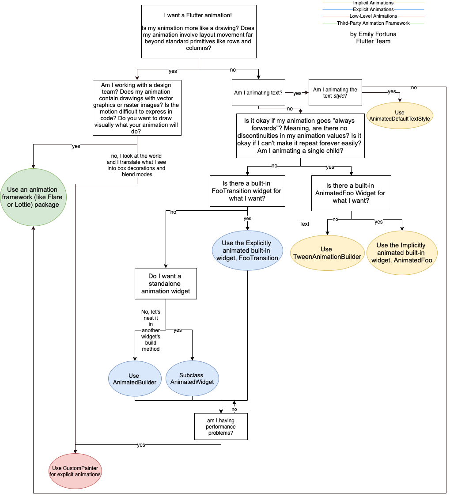

# Flutter Aprendizado

Não vou colocar todos os widgets que existem aqui, apenas alguns notáveis

# Widgets Importantes

## Básicos

Scaffold
- Permite que você implemente design visual nos widgets filhos

Container
- Permite que você manipule cor, posicionamento e tamanho de widgets filhos

## Layout

Padding
- Permite que você adicione espaço em qualquer lado de widgets filhos. Padding usa EdgeInsets.
- Muito útil para delimitar limites aos widgets, pois muitos deles são expansivos por padrão, como o ElevatedButton.

Align
- Permite que você posicione widgets filho dentro de um widget pai. É possível providenciar uma posição específica com ```Alignment(num, num)```

ConstrainedBox
- Permite que você especifique uma altura ou largura máxima ou mínima para o widget filho.
- Caso de uso: Fazer com que um texto grande dentro de uma caixa se divida em dois com quebra de linha.

FittedBox
- Permite que você especifique como um widget filho vai se escalonar e posicionar dentro do widget pai usando o `BoxFit`.

ListView

GridView

LayoutBuilder
- Permite que você possa obter o valor do tamanho do espaço que o widget filho possui, contando com reduções de padding e outros.

Wrap
- Se o Row ou Column causarem overflow, este widget pode ser usado para organizar melhor uma lista de widgets em um espaço de maneira automática.

## Slivers

Os Slivers /não são Widgets, e eles/? devem ser usados dentro de um ScrollView.

ListView is a SliverList. Same with GridView, which is a SliverGrid.
They are doing exactly the same thing. The only difference between them is that SliverList is a sliver, not a widget. Which means it's used inside a ScrollView, usually CustomScrollView.
ListView is nothing else but a biding of SliverList to transform it into a Widget to make it usable alongside other widgets such as Row/Container.

Estranha essa fala pq SliverList herda de Widget. Porém o SliverList é mais capaz do que o ListView.

## Styling

## Painting

ClipRect
- Permite que você defina um retângulo, e tudo o que está fora do retângulo é cortado do widget filho.

Opacity

## Material

Os widgets de Material são botões, cards, barras, inputs, interfaces variadas que implementam um design pre pronto do `Material 3`.

Divider

ListTile

Card

## Async

FutureBuilder

StreamBuilder

## Animation

Como decidir que widget ou builder usar pra fazer uma animação.

